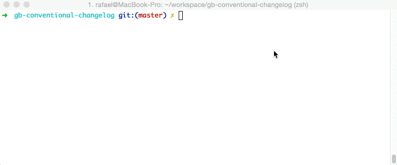

## 前言
AngularJS的commit规范在社区中享有威望，用于解决快速生成`release notes`的问题，而且对于统一规范化有促进.在日常中我们用git来管理代码和进行多人协作开发，为了我们的项目更加完善没有一定规范是不行的，代码要有代码的规范，协作要有协作的规范。今天就来说说Git中`Commit Message`的参考规范。

先来看看[AngularJS项目的Commit message](https://github.com/angular/angular.js/commits/master),再回去看看自己的。

规范的好处:
- 容易生成`CHANGELOG.md`
- 方便识别不重要的提交
- 在浏览 Git 历史时提供更多信息

目前，社区有多种`Commit message`的写法规范。本文介绍[Angular 规范](https://docs.google.com/document/d/1QrDFcIiPjSLDn3EL15IJygNPiHORgU1_OOAqWjiDU5Y/edit#heading=h.uyo6cb12dt6w)，这是目前使用最广的写法，比较合理和系统化，并且有配套的工具,下面是Commitiz工具的使用演示:
## 使用演示


## commit规范
Commit Message 格式:每次提交，Commit message 都包括三个部分：Header，Body 和 Footer。
```js
<type>(<scope>): <subject>
<空行>
<body>
<空行>
<footer>
```
## Header即首行，是可以直接在页面中预览的部分，一共有三个部分`<type>，<scope>，<subject>`，含义分别如下:
#### 1. Type
- feat：新功能（feature）
- fix：修补bug
- docs：文档（documentation）
- style： 格式（不影响代码运行的变动）
- refactor：重构（即不是新增功能，也不是修改bug的代码变动）
- test：增加测试
- chore：构建过程或辅助工具的变动

#### 2. Scope:用来说明本次Commit影响的范围，即简要说明修改会涉及的部分。这个本来是选填项，但从AngularJS实际项目中可以看出基本上也成了必填项了。

#### 3. Subject
- 用来简要描述本次改动，概述就好了，因为后面还会在Body里给出具体信息。并且最好遵循下面三条:
 1. 以动词开头，使用第一人称现在时，比如change，而不是changed或changes
 1. 首字母不要大写
 1. 结尾不用句号(.)

## Body
- <body>里的内容是对上面`subject`里内容的展开，在此做更加详尽的描述，内容里应该包含修改动机和修改前后的对比。

## Footer
Footer 部分只用于两种情况。
#### 1. 不兼容变动

如果当前代码与上一个版本不兼容，则 `Footer` 部分以`BREAKING CHANGE`开头，后面是对变动的描述、以及变动理由和迁移方法。
```
BREAKING CHANGE: isolate scope bindings definition has changed.

    To migrate the code follow the example below:

    Before:

    scope: {
      myAttr: 'attribute',
    }

    After:

    scope: {
      myAttr: '@',
    }

    The removed `inject` wasn't generaly useful for directives so there should be no code using it.
```

#### 2. 关闭 Issue
如果当前`commit`针对某个`issue`，那么可以在`Footer`部分关闭这个`issue` 。
```json
Closes #234
```
也可以一次关闭多个`issue`。
```json
Closes #123, #245, #992
```
## Revert
还有一种特殊情况，如果当前`commit`用于撤销以前的 commit，则必须以`revert:`开头，后面跟着被撤销`Commit`的 `Header`。
```yml
revert: feat(pencil): add 'graphiteWidth' option

This reverts commit 667ecc1654a317a13331b17617d973392f415f02.
```
Body部分的格式是固定的，必须写成`This reverts commit <SHA1>`，其中的hash是被撤销 commit 的 SHA1 标识符。
如果当前`commit`与被撤销的 `commit`，在同一个发布`（release）`里面，那么它们都不会出现在`Change log`里面。如果两者在不同的发布，那么当前 `commit`，会出现在`Change log`的`Reverts`小标题下面。


## 实践
上面就是AngularJS目前的Commit规范，现在就来说说如何把规范变为可执行的具体步骤！

借助神器`Commitiz`这个node工具，在提交时它会以交互式的方式用更具规范的内容引导我们一步一步实施规范。

## 安装commitizen
```
npm install -g commitizen
```
## 配置
安装好之后空参执行`commitizen`会给出使用方法
```
root@kali-slave:~/test# commitizen


    Commitizen has two command line tools:

      1) commitizen -- used for installing adapters into your project
      2) git-cz     -- used for making commits according to convention
                       note: you can run 'git cz' if installed with -g

    Generally if you're using someone else's repo and they've already set up an
    adapter, you're going to just be running:

         git-cz

    However, if you create a new repo and you want to make it easier for future
    contributors to follow your commit message conventions using commitizen then
    you'll need to run a command like this one to add this adapter to your config:

         commitizen init cz-conventional-changelog --save

    You should swap out cz-conventional-changelog for the NPM package name of the
    adapter you wish you install in your project's package.json.

    Detailed usage:

      1) commitizen <sub-command>

         init <adapter-npm-name> [args]

           description: Install a commitizen adapter from npm and adds it to your
                        config.commitizen in your package.json file.

           args:
             --save         Install the adapter to package.json dependencies
             --save-dev     Install the adapter to devDependencies
             --save-exact   Install an exact version instead of a range
             --force        Force install the adapter, even if a previous one exists.

      2) git-cz <any regular git commit arguments>

          description: Runs the commitizen prompter, asking you questions so that you
                       follow the commit conventions of the repository of the current
                       directory.

                       note: git-cz may even be run as 'git cz' if installed with -g.
```
上一步我们在全局范围内安装了commitizen，之后我们就可以在Git仓库中配置我们的Commit规范了。打开项目执行如下命令:
```
commitizen init cz-conventional-changelog --save --save-exact
```
上面的`cz-conventional-changelog`就是AngularJS的规范。此命令帮你完成了下载`cz-conventional-changelog`规范，配置`package.json`(添加依赖和配置应用规范)，想看具体改动打开package.json即可。

## 使用
至此就算完整的安装完了，之后在需要`git commit`的地方更换成`git cz`指令即可呼出Commit的交互界面，提醒你上面规范的各处该怎么填，实在不明在自己建一个项目练习几次就好了。

## 生成 Change log
如果你的所有`Commit`都符合 Angular 格式，那么发布新版本时，`Change log`就可以用脚本自动生成。
生成的文档包括以下三个部分。
```
New features
Bug fixes
Breaking changes.
```
每个部分都会罗列相关的 commit ，并且有指向这些 commit 的链接。当然，生成的文档允许手动修改，所以发布前，你还可以添加其他内容。[conventional-changelog](https://github.com/ajoslin/conventional-changelog) 就是生成 Change log 的工具，运行下面的命令即可。
```
npm install -g conventional-changelog
cd my-project
conventional-changelog -p angular -i CHANGELOG.md -w
```
上面命令不会覆盖以前的 `Change log`，只会在`CHANGELOG.md`的头部加上自从上次发布以来的变动。
如果你想生成所有发布的 `Change log`，要改为运行下面的命令。
hangelog -p angular -i CHANGELOG.md -w -r 0
为了方便使用，可以将其写入package.json的scripts字段。
```json
{
  "scripts": {
    "changelog": "conventional-changelog -p angular -i CHANGELOG.md -w -r 0"
  }
}
```
以后，直接运行下面的命令即可。
```
zhouqi@zhouqi ~/code/nagios_plugins $ npm run changelog

> nagios_plugins@2.0.0 changelog /home/zhouqi/code/nagios_plugins
> conventional-changelog -p angular -i CHANGELOG.md -w -r 0

<a name="2.0.0"></a>
# 2.0.0 (2016-11-02)


### Features

* **fix:** 修复了邮件内容不完整的问题 ([c273e73](http://127.0.0.1:8000/zhouqi/nagios_plugins/commits/c273e73))
* **function:** 实现了对ES的数据聚合报警 ([abab2b9](http://127.0.0.1:8000/zhouqi/nagios_plugins/commits/abab2b9))
```

## 另一种有助于实施规范的方式
编辑文件`.gitmessage.txt`
```
zhouqi@zhouqi ~/code/rtds_gate_test $ cat .gitmessage.txt 

#commit message格式
#
#<type>(<scope>): <subject>
#<BLANK LINE>
#<body>
#<BLANK LINE>
#<footer>
#------------------------------------------
#可选的类型
#
#Must be one of the following:
#
#* feat: A new feature
#* fix: A bug fix
#* docs: Documentation only changes
#* style: Changes that do not affect the meaning of the code (white-space, formatting, missing semi-colons, etc)
#* refactor: A code change that neither fixes a bug nor adds a feature
#* perf: A code change that improves performance
#* test: Adding missing tests
#* chore: Changes to the build process or auxiliary tools and libraries such as documentation generation
```
配置git
```
git config  --globle commit.template .gitmessage.txt
```
使用的话直接运行`git commit -a`会提供你格式模板

## 另一个方便生成`changelog`的工具，[文档地址](https://www.npmjs.com/package/git-changelog)
