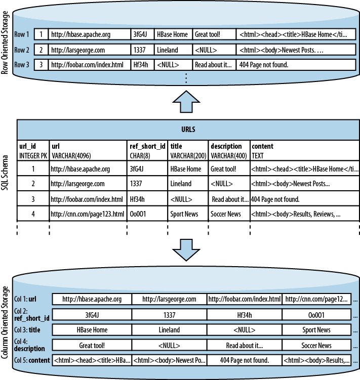

# HBase基础

## HBase是什么
`Apache HBase`是构建于`Hadoop`基础之上，一个分布式、可扩展的大数据存储数据库。

几个主要的特点:
- Linear and modular scalability.
- Strictly consistent reads and writes.
- Automatic and configurable sharding of tables
- Automatic failover support between RegionServers.
- Convenient base classes for backing Hadoop MapReduce jobs with Apache HBase tables.
- Easy to use Java API for client access.
- Block cache and Bloom Filters for real-time queries.
- Query predicate push down via server side Filters
- Thrift gateway and a REST-ful Web service that supports XML, Protobuf, and binary data encoding options
- Extensible jruby-based (JIRB) shell
- Support for exporting metrics via the Hadoop metrics subsystem to files or Ganglia; or via JMX

总结一下: HBase自身功能较为简单，存储也简单(没有数据类型，所有进入HBase的数据统统需要转换为字节数组byte[]，解析数据类型放在客户端操作)，HBase读写性能非常高，也支持压缩。比较适合存储数据量庞大，查询条件较为简单的数据。一些复杂的查询或操作可以借助Hadoop平台(如MR，Spark等工具)处理。

## HBase的存储结构
HBase和普通的RDB存储方式有很大的不同，采用列存储方式。与RDB行存储方式的比较图如下(节选自《HBase权威指南》一书):



上图描述了HBase的存储模型，即列存储。由于一列中的数据存储格式较为接近，因此，这种存储方式压缩率通常比较高。绝大多数查询条件中，都需要按列筛选数据(类似于SELECT column1,column2,... FROM table1 ...这样的SQL查询)，因此，列存储的方式对于读取操作比较友好，效率较高。

下面这个表格展示了HBase的表结构:
<table>
<tbody><tr>
<th rowspan="2">Rowid</th>
<th colspan="3">Column Family</th>
<th colspan="3">Column Family</th>
<th colspan="3">Column Family</th>
<th colspan="3">Column Family</th>                
</tr>
<tr>
<th>col1</th>
<th>col2</th>
<th>col3</th>
<th>col1</th>
<th>col2</th>
<th>col3</th>
<th>col1</th>
<th>col2</th>
<th>col3</th>
<th>col1</th>
<th>col2</th>
<th>col3</th>
</tr>
<tr>
<td>1</td>
<td></td>
<td></td>
<td></td>
<td></td>
<td></td>
<td></td>
<td></td>
<td></td>
<td></td>
<td></td>
<td></td>
<td></td>
</tr>
<tr>
<td>2</td>
<td></td>
<td></td>
<td></td>
<td></td>
<td></td>
<td></td>
<td></td>
<td></td>
<td></td>
<td></td>
<td></td>
<td></td>
</tr>
<tr>
<td>3</td>
<td></td>
<td></td>
<td></td>
<td></td>
<td></td>
<td></td>
<td></td>
<td></td>
<td></td>
<td></td>
<td></td>
<td></td>
</tr>
</tbody></table>

## HBase的术语
HBase中的几个术语需要掌握:

 Term          |              Description
---------------|-----------------------------------------------------
 Row           | HBase中的"行"，包含一个row key(行键)和若干个column(列)
 Column Family | "列族"，相当于列的分组，由多个列构成一个列族。同一列族下的列具有相同的属性
 Column Qualifier | 就是列族下某个具体的"列"，Qualifier的属性受到Column Family限制
 Column        | "列"，表示存储中的某一具体的列，包含列族和Qualifier，用`:`连接: `cf:qualifier`
 Cell          | 就是由行列所唯一确定的单元格。一个单元格可能包含多个version
 Timestamp     | 每个Cell中都会包含一个元数据`Timestamp`，主要用于区分存储的版本

## HBase的架构


整个HBase的架构如上图所示。

### Region
HBase中的表是自动分片存储的，每个分片称为一个`Region`。一个大表很可能被分成多个`Region`，Region大小是HBase自动处理的，也可以手工配置，也可以被手动分割与合并。Region包含完整的数据行，因此是整个表的一个子集。

Region是HBase集群分布式数据的最小单位。

### RegionServer
HBase的节点属性有`Master`和`RegionServer`两种。`RegionServer`提供`Region`服务，存储Region。一个RegionServer可以存储多个Region。客户端连接上来时，最终也会连接到所需数据所在的RegionServer。

### Master
`Master`节点的HBase本身并不存储`Region`，而是存储的元数据，以及监控集群中所有`RegionServer`的状态。通常`Master`部署在HDFS的`NameNode`(HDFS有两种节点角色。其中`DataNode`存储文件系统上的数据，`NameNode`存储的是HDFS中的元数据，`NameNode`节点宕机将导致整个HDFS集群崩溃)。

--------

最初只有一个Region，所有的数据向这一个Region写入，并且HBase会按照`row key`的字节顺序(类似于`String`比大小的算法)写入Region中。当Region增长到一定容量时(该容量可配置)，HBase会将旧的Region分割为容量大致相等的两个小Region。当Region数逐渐增多时，Master也会调度RegionServer，使各个RegionServer存储的Region数量大致相等，使之达到负载均衡的目的。

HBase没有数据类型，因此通常无法处理复杂的逻辑筛选条件。但是HBase的数据存储是按row key有序排列(参考Java中的SortedMap)，因此良好的结构设计至关重要。

HBase中的数据表示:

    (Table, RowKey, Family, Column, Timestamp) → Value

更加程序化的表示:

    SortedMap<RowKey, List<SortedMap<Column, List<Value, Timestamp>>>>

Client会先去连接Zookeeper(0.9以前的老版本需要手工指定Master，新版本推荐连接zookeeper)，以确定Master节点信息，通过Master节点，找到需要的Region存储在哪些RegionServer上，最终向RegionServer发起请求，拿到需要的数据。> 关于HBase几个优化的设计，参考HBase官方文档: http://hbase.apache.org/book.html#schema

> **注意**: Hadoop组件(HDFS，Yarn)以及运行在Hadoop平台之上的程序(如HBase，Hive等)，通信的时候依赖于域名，并非IP。尽管你可以在配置文件中写Zookeeper和HDFS的节点IP，但是要注意这并不够，日志中会打印很多无法解析对方主机名的异常。因此，你的基础设施中需要有DNS，将FQDN解析。当然，也可以写`hosts`文件，解析通信主机的主机名，用于没有内部DNS的环境中。

## HBase数据操作
HBase对数据的操作主要有以下几种方法:

- `Get`: 获取具体的某一行。需要传入至少一个`row key`参数
- `Put`: 新增或修改某一行(rowkey不存在则新增，存在则修改)
- `Scan`: 条件查询，筛选出符合条件的多个行
- `Delete`: 删除指定行。

> `Get`和`Scan`都支持加入[`filter`](https://hbase.apache.org/apidocs/org/apache/hadoop/hbase/filter/package-summary.html)条件，进一步筛选出满足条件的行或列

以下演示采用hbase shell在终端下进行一些查询操作，数据插入的过程参考`mongodb2hbase`[源码](https://github.com/shifudao/how-to/blob/master/mongodb2hbase/src/main/java/com/shifudao/Mongo2HBase.java)。

对插入的数据简单说明一下:
<table>
   <colgroup><col>
   <col>
   <col>
   <col>
   <col>
   <col>
   <col>
   </colgroup><tbody><tr>
    <td></td>
    <td  colspan="5">rtdata</td>
    <td  colspan="3">hourly</td>
   </tr>
   <tr>
    <td></td>
    <td>0</td>
    <td>10000</td>
    <td>20000</td>
    <td>...</td>
    <td>3590000</td>
    <td>1</td>
    <td>2</td>
    <td>...</td>
   </tr>
   <tr>
    <td>[src][hourlytimestamp]</td>
    <td>'{json_string}'</td>
    <td>'{json_string}'</td>
    <td>'{json_string}'</td>
    <td></td>
    <td>'{json_string}'</td>
    <td>result</td>
    <td>result</td>
    <td></td>
   </tr>
   <tr>
    <td>...</td>
    <td  colspan="8"></td>
   </tr>
  </tbody></table>

以上是HBase中的数据结构。

`src`, `timestamp`, `hourlytimestamp`均为`Long`型整数，存库时作`org.apache.hadoop.hbase.util.Bytes.toBytes()`处理，从而转成`byte[]`类型。

> 例如`src`为`358`，`hourlytimestamp`为`1466254800000`，
则src的byte数组为: `\x00\x00\x00\x00\x00\x00\x01\x66`, `hourlytimestamp`的byte数组为: `\x00\x00\x01\x55\x63\x98\xB4\x80`。
最终，这个`rowkey`就是`\x00\x00\x00\x00\x00\x00\x01\x66\x00\x00\x01\x55\x63\x98\xB4\x80`。

`rtdata`这个列族下面存放的是自整点小时开始，0秒，10秒(10000毫秒)，20秒(20000毫秒)，直到3590秒(3590000毫秒)，同理这个int也做了Bytes.toBytes()处理，
例如"`rtdata:\x00\x00\x27\x10`"这个column存储的就是整点小时过10秒的记录。
shell下对应的操作:

     hbase> get "aircareRealtimeDB", "\x00\x00\x00\x00\x00\x00\x01\x66\x00\x00\x01\x55\x63\x98\xB4\x80", "rtdata:\x00\x00\x27\x10"

现在对我们目前用到的查询做个小结，以hbase shell为例演示，对应到java api也相当容易。

### 取设备x最后一条记录:

先将x转换为long型，然后Bytes.toBytes(x)处理。
```
    scan "aircareRealtimeDB", {STARTROW => "\x00\x00\x00\x00\x00\x00\x00\x02\xFF", ENDROW => "\x00\x00\x00\x00\x00\x00\x00\x02", REVERSED => true, LIMIT => 1}   
    # 这里假定src为2，注意REVERSED参数会反向排序，因此注意STARTROW和ENDROW的范围也必须倒排。
```

> 另: hbase中，STARTROW, ENDROW会构成半开半闭区间，[STARTROW,ENDROW)，即查询结果包含STARTROW，但不包含ENDROW，使用时要特别注意。

### 取出设备所有的记录/判断某个设备是否上报过数据
```
scan "aircareRealtimeDB", {ROWPREFIXFILTER => "\x00\x00\x00\x00\x00\x00\x00\x03"}
# 这里假定src为3，只是判断是否存在某设备的数据的话，可以加上LIMIT => 1参数，限制一下返回的数量。
```

### 取出某设备某一段时间的记录:
```
scan "aircareRealtimeDB", {ROWPREFIXFILTER => "\x00\x00\x00\x00\x00\x00\x00\x02", TIMERANGE => [1466563400123,1466564400123]}
# 这里用了ROWPREFIX和TIMERANGE两个filter，为了让hbase扫描更少的结果，推荐使用STARTROW，ENDROW限制更小的范围，替代ROWPREFIXFILTER，但就上个查询条件来说，ROWPREFIXFILTER和STARTROW/ENDROW的效率是等效的。
```

### 查询分页
Hbase其实并未实现分页的功能，但是有LIMIT的功能查询第一页(对应Java API中的`public Scan setMaxResultSize(long maxResultSize)`)，以及[`PageFilter`](https://hbase.apache.org/apidocs/org/apache/hadoop/hbase/filter/PageFilter.html)用于限制每页大小。

HBase权威指南中的代码[范例](https://github.com/larsgeorge/hbase-book/blob/master/ch04/src/main/java/filters/PageFilterExample.java)，整个算法采用了“seek method”的方法。即每次查询的时候记下最后一条记录的rowkey。
