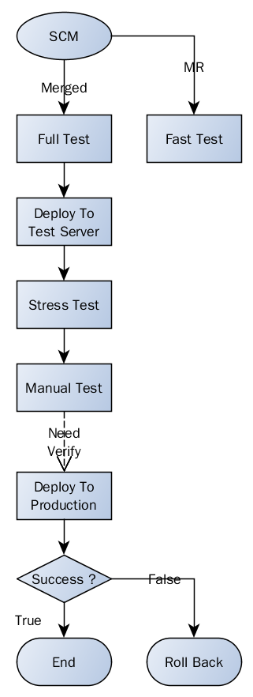

# Jenkins构建流水线介绍
Jenkins是目前我们实现CI(Continuous Integration)而使用的一款开源软件。这篇文档将对Jenkins以及我们目前的流水线做一个简介。

## 什么是持续集成(Continuous Integration)

持续集成指的是，频繁地（一天多次）将代码集成到主干。

它的好处主要有两个:

* **快速发现错误**。每完成一点更新，就集成到主干，可以快速发现错误，定位错误也比较容易。
* **防止分支大幅偏离主干**。如果不是经常集成，主干又在不断更新，会导致以后集成的难度变大，甚至难以集成。

## Jenkins简介
[Jenkins](https://jenkins.io)是一个用Java编写的开源的持续集成工具。Jenkins安装和使用都很容易，功能也很强。主要有以下几个优势:

* Java开发，天生对Java相关的项目友好
* 社区活跃，插件种类繁多。几乎能满足各种需求的定制
* 使用配置较为简单。常用的功能插件基本都提供了，只需简单的配置就可以形成一套流水线
* Jenkins 2.0以上版本引入更为灵活的[pipeline plugin](https://jenkins.io/doc/pipeline/)，可以更方便更灵活地构建更加现代化的CI方式。官方示例的一个典型Pipeline流程图如下:

## 目前我们的CI流水线示意图

如上图所示，是我们目前采用的CI流程示意。大致描述一下完整的流水线:

1. 开发者以Merge Request形式向中央仓库发起合并请求
2. 触发Jenkins的快速测试任务(只有单元测试)
3. 中央仓库审核人员合并MR请求，代码被PUSH到中央仓库中
4. 触发Jenkins的完全测试任务(所有的自动化测试项，包括单元测试，集成测试，其他测试等)
5. 测试通过后，触发部署到测试机的流程，部署完毕后，将部署结果以邮件形式通知
6. 触发自动化压力测试(目前暂未实现)
7. 压力测试结束后，将收到压力测试统计报表邮件(目前暂未实现)，此时流水线将处于等待确认状态
8. 人工完成其余未实现自动化的测试
9. 整个测试完成，由相关负责人决定发布时间点，继续流水线任务，发布至产品环境
10. 观察产品环境运行状态，有严重的错误将由相关负责人启动回滚操作(目前暂未实现)

以上所有阶段步骤均可以中断，等待进行下一次集成流程，并且除过部署和压力测试步骤，均可以并行执行，提高效率。

以上所有步骤均可以单独手工触发执行，以防止自动化流水线出现问题时可以人工干预。
